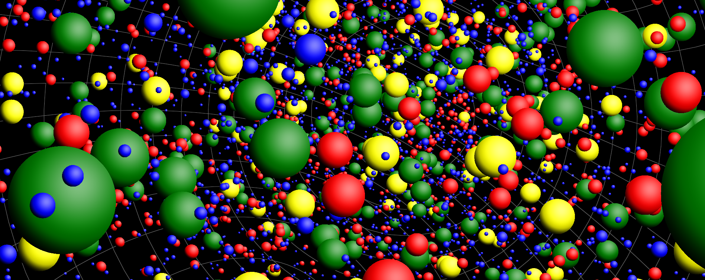

Bromium
=======
Fast Brownian motion particle movement simulator.

Sub-libraries
-------------
Bromium consists of the following set of smaller libraries:

- `bromium.math` Collection of general mathematical algorithms
- `bromium.views` Additional typed views
- `bromium.structs` Data structures for the simulation
- `bromium.kinetics` Simulation kinetics algorithms
- `bromium.nodes` Library for node based scene modeling
- `bromium.engine` Controller for an isolated simulation with nodes
- `bromium.renderer` Simulation 3D renderer

Code conventions
----------------
### Sanity checks
It is discouraged to add sanity checks to data structures (for example to detect
impossible reactions). This makes the code more complex and less readable.
Instead the code should be more resilient towards incorrect data.

### Types
In almost all circumstances it is preferred to use types from the `vector_math`
library to keep the code more readable. Array to vector conversion should be
minimized.

### Loops
Prefer for-in loops over forEach loops. For-in loops look cleaner and are
not officially closures.

### Final
Use final in for loops when possible (e.g. `for (final thing in things)`). Do
not use final in method or function arguments. These are almost always final and
adding final to all final arguments would add a lot of code. Besides, it's not a
common practice to add final to arguments.

### Comments
Meaningless comments such as `/// Constructor` or copied comments from the
super class should be omitted.

### Error messages
Error messages should be full sentences.

Topics for further research
---------------------------
### Optimization of reaction finding
Currently a voxel based approach is used where all inter-voxel reactions are
implicitly discarded. Alternative approaches have shown significant lower
performance. More performance might be gained by caching results from previous
cycles, or by using a different voxel number computation such as a Z-order
curve. A very interesting question is how much the voxel approach hurts the
accuracy of the entire simulation.

### Accuracy of brownian motion
Currently a not too accurate approach is used to compute the random motion. Each
cycle the particle is displaced by a normalized vector that points in a random
direction times a random number between 0 and 1.

### Membrane protein motion
Membrane proteins can be simulated using sticky particles. Currently there is no
implementation to simulate membrane protein dynamics. The amount of motion that
should be applied to sticky particles to simulate accurate membrane dynamics has
yet to be researched.
